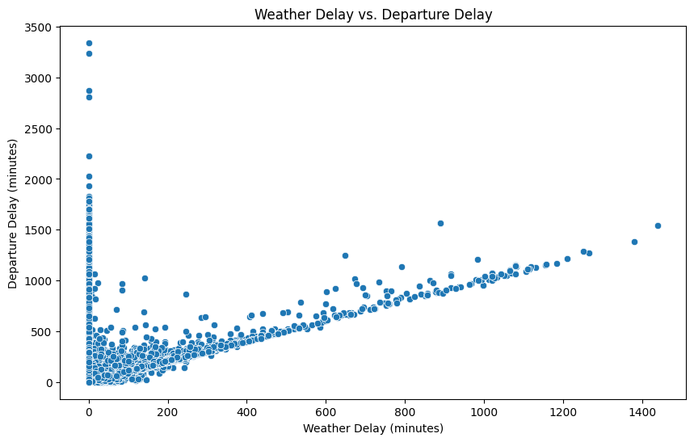
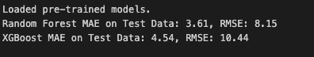
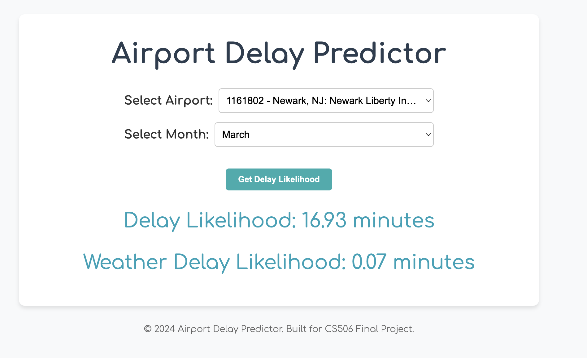

# Flight Delay Prediction Using Weather Data

**Objective** :  
This project aims to develop a predictive model that forecasts flight delays
using weather data. Accurately predicting delays can help airlines, passengers,
and airports better manage time and resources.

## Goals:
We aim to predict flight delay likelihood based on weather conditions, such as
precipitation and wind speed.

## How to build and run : 
Clone the repository and then install dependecnies using `make install` to set up 
the enviornment. Then to run the Flask application, run `make run` to access the
application in the browser at `http://127.0.0.1:3000` .

## Supported Enviornments
Oue program is compatible with Python 3.8 or later. The supported operating systems would be
macOS, Linux, or Windows. There are a variety of dependencies that are also needed such as 
pandas, numpy, scikit-learn, xgboost, and joblib. These libraries, however will be installed 
using requirements.txt.

## Data Source
- https://open-meteo.com/ for weather data by (lat,long)

- https://www.transtats.bts.gov/DL_SelectFields.aspx?gnoyr_VQ=FGJ&QO_fu146_anzr=b0-gvzr
for flights and delay information, coordinates of departing airport

## Data Collection:
We will gather:
- **Historical Flight Data**: Including details on departure, arrival airports,
  and delay durations. U.S. 2023, 12 months.
- **Weather Data**: Temperature, precipitation, wind speed, and visibility data,
  linked to corresponding flight information.

## Modeling Approach:
We plan to use **tree models or XGBoost** to predict delays based on weather
conditions. Though clustering like **KMeans** is typically used for unsupervised
tasks, we initially planned to explore it for grouping weather patterns that
correlate with delays. However, since our data is labeled, we will focus more on
supervised learning techniques.

## Visualization:
We will develop interactive visualizations such as scatter plots to show the
relationship between delays and weather conditions, and time graphs to visualize
delay trends over time.

This scatterplot shows the weather delays vs the departure delays with each dot 
representing a flight. There is a clear positive trend that higher weather delays
tend to correspond to higher departure delays and flights with minimal weather
delays tend to have lower corresponding departure delays as well. There are a few 
extreme outliers where the departure delay occurs when weather delay is zero and
these delays can be due to other factors such as operations or crew. This conveys 
that weather delays have a significant impact on departure delays but are not the
only factor of delays and the positive correlation shows that weather is an 
important predictor of days. 

## Test Plan:
We will split the dataset of each month into 80% training and 20% testing data,
training the model on one time period and testing on another to evaluate performance
over time.

## Description of data processing and modeling: 
The flight data is aggregated from multiple CSV files using Python's glob and pandas.
All the datasets are concatenated into a single Dataframe. Through data preprocessing, 
any missing values were handled therefore if a column was empty it was replaced with a
zero. Rows with missing DepDelayMinutes were also removed. Furthermore, columns such as 
reporting airlines and origin state are converted into numerical features using one-hot
encoding. Non relevant columns are then dropped and the target variable becomes more 
defined. The numerical features are then prepared for machine learning models such as
Random Forest and XGBoost.

For the modeling, the two machine learning models to predict departure delay are
Random Forest Regressor whhich shows the non linear relationship between weather and
the departure delay as well as providing a baseline for comparison. The second model is the
XGBoost Regressor in which a gradient boosted tree model is used for efficency and accuracy. 

## ./preprocess
Run `make` inside this directory to make `./processed_data` which flight delay
data with weather data. Unfortunately our data source for fights does not have
hour granularity (meaning we only have the date of the flight, not the time), so
we couldn't take advantage of hourly weather data and have to train the model
based on daily weather data.

## Results:
Testing the model using our 20% testing data, we got the results "Random Forest MAE 
on Test Data: 3.61, RMSE: 8.15" and "XGBoost MAE on Test Data: 4.54, RMSE: 10.44". With
the Random Forest model, this shows that on average the models prediction if off by 3.61
showing good accuracy. The RMSE being 8.15 while the MAE is low implies that some larger 
mistakes are happening as well. The XGBoost's model is slightly less accurate with an 
average of 4.54. The RMSE is significantly higher meaning that there are more significant
outliers compared to the Random Forest model. The results imply that in this test, Random 
Forest outperforms XGBoost with a lower MAE and RMSE meaning it is more accurate at 
predicting delays. The lower RMSE shows that Random Forest is also better at handling larger 
errors compared to XGBoost.

The below are results shown by our interactive tool. Users are able to select an airport
and select a month to display the likelihood of a delay and then the likelihood a delay 
due to weather reasons. We see in this example below that the delay likelihood is about 17
minutes which is a significant difference from the weather delay likelihood meaning that the
delay is likely due to other reasons other than weather

## **MIDTERM VIDEO**: 
https://youtu.be/2EWXgbAuChQ?si=ilrdndmAVqUP-JZF

## Distribution of work
  * Ross: preprocess data
  * Ashkat: model training
  * Lauren: data collection & testing
  * Tiffany: data & model training
  * Aurora: preprocessing data (e.g. join weather data w/ flight data on
    (lat,long) coordinate).

